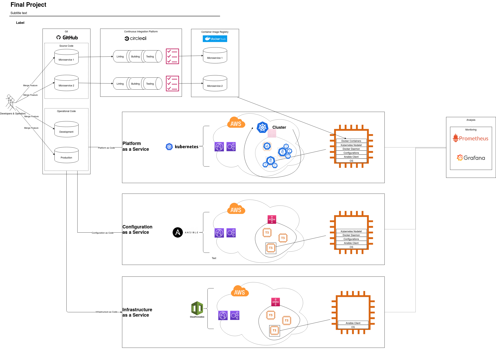

[![Circle CI][circle-ci-status]][circle-ci]

# CI-CD_sandbox

Exemplary code for applying continuous integration and deployment on source code

[circle-ci-status]: https://circleci.com/gh/DerNeuburger/CI-CD_sandbox/tree/development.svg?style=shield&circle-token=8271143c73d7cb44dc6c3e1a872c41b26247d31a
[circle-ci]: https://circleci.com/gh/DerNeuburger/CI-CD_sandbox/tree/development

Table of Contents =================

* [CI-CD_sandbox](#ci-cd_sandbox)
* [GitOps Architecture](gitops-architecture)
* [Installation](#installation)
* [Deployment - Locally](#deployment---locally)
* [Deployment - Remotely](#deployment---remotely)
* [Troubleshooting](#troubleshooting)

## GitOps Architecture

The architecture this repository is referring to is based on the GitOps pattern. 
This repository therefore contains the source of truth for source and operation code.
In the following diagram you can see how the architecture is designed for this software.



## Installation

In order to test the CI/CD pipelines locally, you must install CircleCI Local
CLI[here](https://circleci.com/docs/2.0/local-cli/).

## Deployment - Locally

For deploying CircleCI locally, you must can run...

1. All jobs

   ```
   sudo make test-circleci-run
   ```

1. Specific Jobs

   ```
   JOBNAMES=( "<jobname>" )
   sudo make test-circleci-run JOBNAMES=$JOBNAMES
   ```

   If an non-expected error occurs it can have already known reasons. Please see
   the section [Troubleshooting](#troubleshooting).

## Deployment - Remotely

Commits published on branch "development" are automatically immediately
processed by the CircleCI pipeline. The status badge indicates success or
failure.

## Troubleshooting

* *docker --tag syntax supposed to be wrong when running CircleCI locally.*
   This is an indicator that probably the environment variables are not correctly
   passed to the executor. This is a known [issue](
   https://github.com/CircleCI-Public/circleci-cli/issues/391) with a proposed [
   pull request](https://github.com/CircleCI-Public/circleci-cli/pull/395).
   When passing multiple environment variables via ```-e``` flag in the circleci
   command line client, they are incorrectly processed. In order to solve this
   issue, one can downgrade the client to version ```0.1.6772``` as suggested
   [here](https://github.com/CircleCI-Public/circleci-cli/issues/391). \
   This is achieved by running the following commands subsequently:

   ```
   rm -r /usr/bin/circleci # Deinstall current circleci client as suggested [here](https://circleci.com/docs/2.0/local-cli/#uninstallation)
   ```

   and then running setting the ```OS``` variable.

   ```
   OS="linux"
   #OS="darwin"
   VERSION="0.1.6772"
   RELEASE_URL="https://github.com/CircleCI-Public/circleci-cli/releases/download/v0.1.6772/circleci-cli_${VERSION}_${OS}_amd64.tar.gz"
   curl -sL --retry 3 "${RELEASE_URL}" | tar zx --strip 1
   mv circleci "$DESTDIR"
   chmod +x "$DESTDIR/circleci"
   ```
