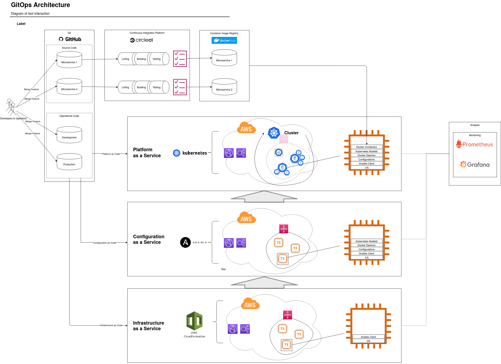

[![Circle CI][circle-ci-status]][circle-ci]

[circle-ci-status]: https://circleci.com/gh/DerNeuburger/CI-CD_sandbox/tree/development.svg?style=shield&circle-token=8271143c73d7cb44dc6c3e1a872c41b26247d31a
[circle-ci]: https://circleci.com/gh/DerNeuburger/CI-CD_sandbox/tree/development

# CI-CD_sandbox


This repository contains the source code for the Udacity Capstone Project for the Nanodegree 'Cloud DevOps Engineer'. It aims to implement the basic structure of the GitOps architecture which allows to version-control development and operation. Regarding operation a strict seperation between Infrastructure as Code, Configuration as Code and Platform as code is implemented to allow easier migration between toolings/services of each layer. In the current implementation a containerized static webpage is orchestrated on an autoscaled and load-balanced group of webservers which are protected with a bastion-host approach. Due to a weighted DNS, Continuous Deployment is achieved allowing Green/Blue or Canary Deployments. Regarding development Contiuous Integration tests the software code before being deployed on production stage.

Table of Contents =================

* [GitOps Architecture](gitops-architecture)
* [Installation](#installation)
* [Deployment - Operation](#deployment---operation)
* [Deployment - Development](#deployment---development)
* [Troubleshooting](#troubleshooting)

## GitOps Architecture

The architecture this repository is referring to is based on the GitOps pattern.
This repository therefore contains the source of truth for source and operation code.
In the following diagram you can see how the architecture is designed for this software.



Infrastructure as Code is implemented with AWS Cloudformation. In this repository the Virtual Private Cloud
has the following architecture:


Configuration as Code is implemented with Ansible and fetches the current server properties through a designated interface.
It configures one server as the a Kubernetes Orchestration Master and setups up the rest as Kubernetes workers.
Finally, the application can be run on the spun up platform of kubernetes in form of pods, that run the Docker container
which hosts the static webpage on each of the servers. This container is pulled from DockerHub's container registry.
This given container is built and pushed to this registry, whenever software code was changed and passed through an implemented CircleCI and Jenkins Continuous Integraton pipeline.

## Installation

Installations are only needed, if CircleCI should run locally. In this case you must install CircleCI Local
CLI[here](https://circleci.com/docs/2.0/local-cli/).

## Deployment - Operation


## Deployment - Development

Commits published on branch "development" are automatically immediately
processed by the CircleCI pipeline and your Jenkins pipeline. The status badge indicates success or
failure.
For deploying CircleCI locally, you must can run...

1. All jobs

   ```
   sudo make test-circleci-run
   ```

1. Specific Jobs

   ```
   JOBNAMES=( "<jobname>" )
   sudo make test-circleci-run JOBNAMES=$JOBNAMES
   ```

   If an non-expected error occurs it can have already known reasons. Please see
   the section [Troubleshooting](#troubleshooting).

## Deployment - Remotely


## Logging

### Cloudformation

Stdout/Stderr of Userdata deployed on instance creation in EC2 are logged into the following file on the instance:

```
/var/log/cloud-init-output.log
```

## Troubleshooting

* *docker --tag syntax supposed to be wrong when running CircleCI locally.*
   This is an indicator that probably the environment variables are not correctly
   passed to the executor. This is a known [issue](
   https://github.com/CircleCI-Public/circleci-cli/issues/391) with a proposed [
   pull request](https://github.com/CircleCI-Public/circleci-cli/pull/395).
   When passing multiple environment variables via ```-e``` flag in the circleci
   command line client, they are incorrectly processed. In order to solve this
   issue, one can downgrade the client to version ```0.1.6772``` as suggested
   [here](https://github.com/CircleCI-Public/circleci-cli/issues/391). \
   This is achieved by running the following commands subsequently:

   ```
   rm -r /usr/bin/circleci # Deinstall current circleci client as suggested [here](https://circleci.com/docs/2.0/local-cli/#uninstallation)
   ```

   and then running setting the ```OS``` variable.

   ```
   OS="linux"
   #OS="darwin"
   VERSION="0.1.6772"
   RELEASE_URL="https://github.com/CircleCI-Public/circleci-cli/releases/download/v0.1.6772/circleci-cli_${VERSION}_${OS}_amd64.tar.gz"
   curl -sL --retry 3 "${RELEASE_URL}" | tar zx --strip 1
   mv circleci "$DESTDIR"
   chmod +x "$DESTDIR/circleci"

## Setup Configuration as Service

SSH via bastion-host into ansible-master host, using the webserver's private ssh key. Copy the private key to the root folder and setup aws_cli with credentials. Then run


```
ansible-inventory -i aws_ec2.yaml --output inventory.yml --list
ansible-playbook -i inventory.yml --private-key=~/webservers.pem -vvvv playbook.yml


```  ```
