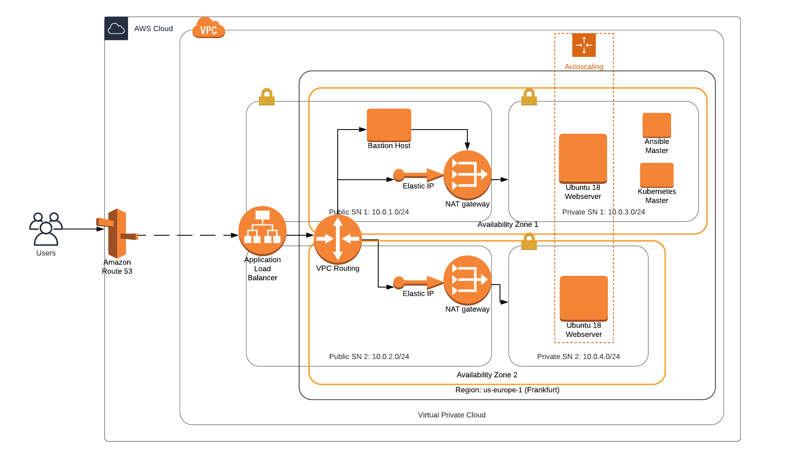

[![Circle CI][circle-ci-status]][circle-ci]

[circle-ci-status]: https://circleci.com/gh/DerNeuburger/CI-CD_sandbox/tree/development.svg?style=shield&circle-token=8271143c73d7cb44dc6c3e1a872c41b26247d31a
[circle-ci]: https://circleci.com/gh/DerNeuburger/CI-CD_sandbox/tree/development

# CI-CD_sandbox

This repository contains the source code for the Udacity Capstone Project for
the Nanodegree 'Cloud DevOps Engineer' and contains code of a static webpage
which are owned by Udacity. It aims to implement the basic structure
of the GitOps architecture which allows to version-control development and
operation. Regarding operation a strict seperation between Infrastructure as
Code, Configuration as Code and Platform as code is implemented to allow easier
migration between toolings/services of each layer. In the current implementation
a containerized static webpage is orchestrated on an autoscaled and
load-balanced group of webservers which are protected with a bastion-host
approach. Due to a weighted DNS, Continuous Deployment is achieved allowing
Green/Blue or Canary Deployments. Regarding development Contiuous Integration
tests the software code before being deployed on production stage.

Table of Contents =================

* [GitOps Architecture](#gitops-architecture)
* [Installation](#installation)
* [Operation Deployment](#operation-deployment)
* [Operation Update](#operation-update)
* [Development](#deployment)
* [Shutdown](#shutdown)
* [Troubleshooting](#troubleshooting)

## GitOps Architecture

The architecture this repository is referring to is based on the GitOps pattern.
This repository therefore contains the source of truth for source and operation
code. In the following diagram you can see how the architecture is designed for
this software.


Infrastructure as Code is implemented with AWS Cloudformation. In this
repository the Virtual Private Cloud has the following architecture:



Configuration as Code is implemented with Ansible and fetches the current server
properties through a designated interface. It configures one server as the a
Kubernetes Orchestration Master and setups up the rest as Kubernetes workers.
Finally, the application can be run on the spun up platform of kubernetes in
form of pods, that run the Docker container which hosts the static webpage on
each of the servers. This container is pulled from DockerHub's container
registry. This given container is built and pushed to this registry, whenever
software code was changed and passed through an implemented CircleCI and Jenkins
Continuous Integraton pipeline.

## Installation

Installations are only needed, if CircleCI should run locally. In this case you
must install CircleCI Local CLI[here](https://circleci.com/docs/2.0/local-cli/).

## Operation Deployment

### Infrastructure

In a first step, add Key-Value pairs to your AWS EC2-Dashboard that are later related to your instances and download their ```.pem``` key files for later setup. The actual
deployment relevant infrastructure is generated by running:

```
./run_infrastructure <deployment-name>
```

The argument ```<deployment-name>``` can e.g. be 'development', 'production',
...

If the deployment should contain the Jenkins Server instance as well, run:

```
./run_infrastructure --module jenkins-server <deployment-name>
```

Finally, one DNS server should be instantiated by running:

```
./run_infrastructure --module dns-server <unique-name>
```

### Configuration

In order to configure your servers and setup Kubernetes as the platform
orchestration tool, you must SSH into the Ansible Master server instance. This
is achieved by, first, creating an SSH connection to the bastion-host and copy
the SSH key required to connect to the ansible-master host. All required
information (ip-addresses, ssh keys) for this step can be retrieved from AWS
management console or using the AWS CLI

```
scp -i <bastion-host-key> <path-to-ansible-master-key> ubuntu@<public-ip-bastion-host>:/home/ubuntu/.ssh/<name-ansible-master-key>
scp -i <bastion-host-key> ubuntu@<public-ip-bastion-host>
```

Then repeat this process with from the current bastion-host towards the ansible
master:

```
scp -i <ansible-master-key> <path-to-ansible-master-key> ubuntu@<private-ip-ansible-master>:/home/ubuntu/.ssh/<name-ansible-master-key>
scp -i <bastion-host-key> ubuntu@<private-ip-ansible-master>
```

Now the configuration of the servers can be started. To configure the Jenkins
Server, run:

```
ansible-playbook --private-key=<path-to-private-ssh-key> -vvvv playbooks/jenkins-server-install.yml
```

For setting up the kubernetes master and workers, run:

```
ansible-playbook --private-key=<path-to-private-ssh-key> -v playbooks/kubernetes-install.yaml
ansible-playbook --private-key=<path-to-private-ssh-key> -v playbooks/kubernetes-master-setup.yaml
ansible-playbook --private-key=<path-to-private-ssh-key> -v playbooks/kubernetes-worker-setup.yaml
```

### Platform

Run the Docker container from the DockerHub repository on every worker node and
wait until they are up and running

```
kubectl apply -f static_webpage_pod.yaml
kubectl wait --for=condition=Ready pod/static-webpage
```

## Operation Update

### Infrastructure

For minor changes in the infrastructure that are well expectable in its behavior, one can update a single stack (aka. module) in Cloudformation by running:

```
./run_infrastructure -u --module <module-name> <deployment-name>
```

However, whenever an bigger infrastructural update ready to be deployed in production, the infrastructure should be spawned in parallel and users should be redirected using the weighted DNS. This is visualized in the diagram below.


The DNS is setup by running

```
./run_infrastructure --module dns <unique-name>
```

If its weights should be updated, just run:

```
./run_infrastructure -u --module dns <unique-name>
```


### Configuration

If a minor configuration change with expectable consequences should be deployed to production, one can run

1. for changing just one or multiple single instances for in production testing

```
ansible-playbook --private-key=<path-to-private-ssh-key> --limit <host-group-name>[0] -v playbooks/<playbook-name>
```

2. for changing the whole fleet

```
ansible-playbook --private-key=<path-to-private-ssh-key> -v playbooks/<playbook-name>
```


on the Ansible Master server
However, if a bigger configurational update is ready to be deployed to production, a whole infrastructure should be spawned in parallel (see above) to ensure zero-downtime.


### Platform

If an application update was pushed to the registry and should be deployed in production, Kubernetes musst be instructed to let all pods fetch the new image. This is achieved by running

```
kubectl edit ds/static-webpage -n kube-system
```

on the Kubernetes Master server.


## Development

Commits published on branch "development" are automatically immediately
processed by the CircleCI pipeline and your Jenkins pipeline. The status badge
indicates success or failure. For deploying CircleCI locally, you must can
run...

1. All jobs

   ```
   sudo make test-circleci-run
   ```

1. Specific Jobs

   ```
   JOBNAMES=( "<jobname>" )
   sudo make test-circleci-run JOBNAMES=$JOBNAMES
   ```

   If an non-expected error occurs it can have already known reasons. Please see
   the section [Troubleshooting](#troubleshooting).


## Shutdown

To shutdown the infrastructure, first shutdown the jenkins server instance if it
exists:

```
./run_infrastructure -d --module jenkins-server <deployment-name>
```

Afterwards, shutdown the weighted DNS service:

```
./run_infrastructure -d --module dns-server <deployment-name>
```

Then shutdown all other instances:

```
./run_infrastructure -d <deployment-name>
```

Finally, make sure in your AWS account or via AWS CLI, that all stacks have been
deleted from your Cloudformation stack.

## Troubleshooting

* *docker --tag syntax supposed to be wrong when running CircleCI locally.* This
   is an indicator that probably the environment variables are not correctly
   passed to the executor. This is a known [issue](
   https://github.com/CircleCI-Public/circleci-cli/issues/391) with a proposed [
   pull request](https://github.com/CircleCI-Public/circleci-cli/pull/395). When
   passing multiple environment variables via ```-e``` flag in the circleci
   command line client, they are incorrectly processed. In order to solve this
   issue, one can downgrade the client to version ```0.1.6772``` as suggested
   [here](https://github.com/CircleCI-Public/circleci-cli/issues/391). \ This is
   achieved by running the following commands subsequently:

   ```
   rm -r /usr/bin/circleci # Deinstall current circleci client as suggested [here](https://circleci.com/docs/2.0/local-cli/#uninstallation)
   ```

   and then running setting the ```OS``` variable.

   ``` OS="linux" #OS="darwin" VERSION="0.1.6772"
   RELEASE_[URL](https://github.com/CircleCI-Public/circleci-cli/releases/download/v0.1.6772/circleci-cli_${VERSION}_${OS}_amd64.tar.gz)
   curl -sL --retry 3 "${RELEASE_URL}" | tar zx --strip 1 mv circleci "$DESTDIR"
   chmod +x "$DESTDIR/circleci"
